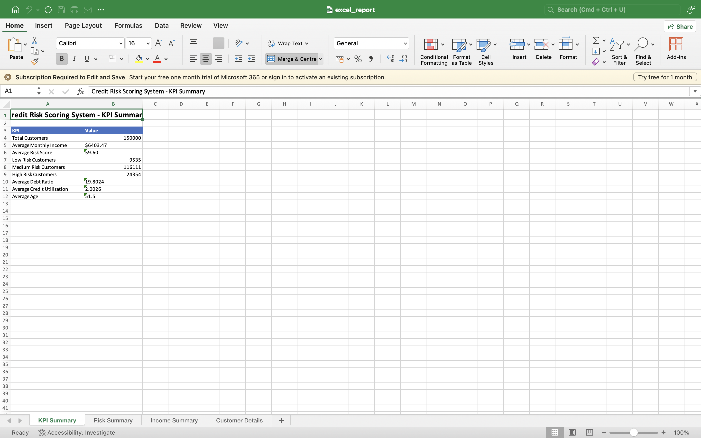
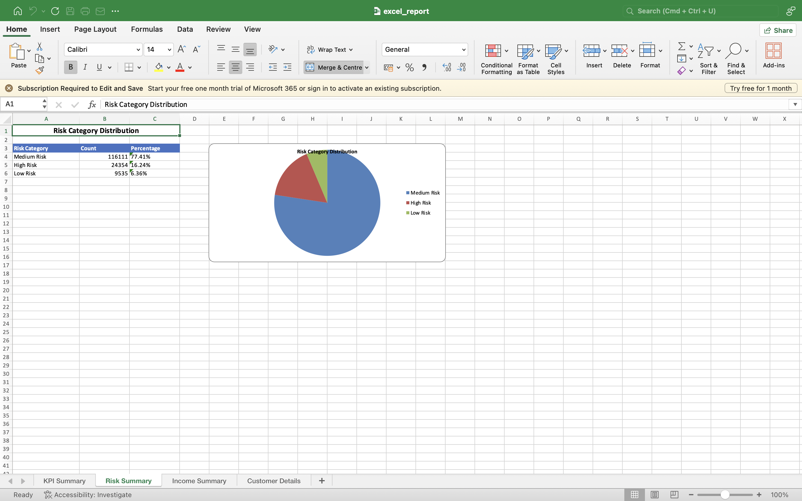
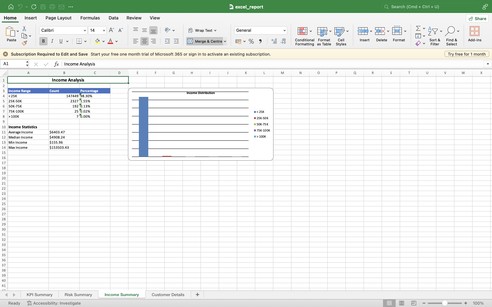
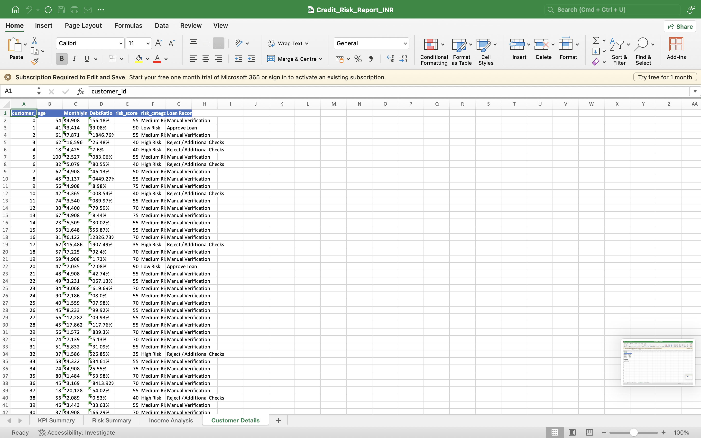

# Credit Risk Scoring System

A Python-based Credit Risk Scoring System that analyzes customer financial data, assigns credit risk levels, recommends loan decisions, and generates an automated Excel banking report.

The project processes **150,000 customer records** and demonstrates how financial institutions can use data analysis to support credit approval decisions.

---

## Features

- Cleans and processes customer financial data using Python.
- Calculates a Credit Risk Score for every customer.
- Classifies customers into Low, Medium, and High Risk categories.
- Generates loan recommendations:
  - ✅ Approve Loan
  - ⚠️ Manual Verification
  - ❌ Reject / Additional Checks
- Creates an automated Excel banking report with charts and summaries.
- Uses Indian Rupee (₹) for all financial values.

---

## Technologies Used

- Python
- Pandas
- NumPy
- OpenPyXL
- CSV Dataset

---

## Project Structure

```
Credit-Risk-Scoring-System
│
├── data/
│   ├── raw_data.csv
│   └── cleaned_data.csv
│
├── reports/
│   ├── risk_scores.csv
│   └── excel_report.xlsx
│
├── screenshots/
│   ├── kpi_summary.png
│   ├── risk_distribution.png
│   ├── income_analysis.png
│   └── customer_details.png
│
├── src/
│   ├── data_cleaning.py
│   ├── risk_scoring.py
│   └── excel_report.py
│
├── requirements.txt
└── README.md
```

---

## Workflow

```
Raw Customer Data
        │
        ▼
Data Cleaning
        │
        ▼
Credit Risk Scoring
        │
        ▼
Loan Recommendation
        │
        ▼
Excel Banking Report
```

---

# Excel Report Preview

## KPI Dashboard

Shows key business metrics including:

- Total Customers
- Average Monthly Income
- Average Risk Score
- Customer Age
- Risk Category Summary



---

## Risk Distribution

Displays customer distribution across:

- Low Risk
- Medium Risk
- High Risk

along with a pie chart for quick analysis.



---

## Income Analysis

Summarizes customer income ranges and displays:

- Average Income
- Median Income
- Maximum Income

using Indian Rupees (₹).



---

## Customer Details

Displays customer-level information including:

- Customer ID
- Age
- Monthly Income
- Debt Ratio
- Risk Score
- Risk Category
- Loan Recommendation



---

# How to Run

## 1 Clone Repository

```bash
git clone https://github.com/gurmej2004-gs/Credit-Risk-Scoring-System.git

cd Credit-Risk-Scoring-System
```

---

## 2 Create Virtual Environment

```bash
python3 -m venv venv

source venv/bin/activate
```

---

## 3 Install Dependencies

```bash
pip install -r requirements.txt
```

---

## 4 Run the Project

```bash
cd src

python3 data_cleaning.py

python3 risk_scoring.py

python3 excel_report.py
```

---

# Generated Outputs

After execution the following files are created:

```
reports/

├── risk_scores.csv
└── excel_report.xlsx
```

The Excel report contains:

- KPI Dashboard
- Risk Distribution
- Income Analysis
- Customer Details
- Charts
- Loan Recommendations

---

# Business Value

This project demonstrates a simplified credit risk assessment workflow similar to that used in banking institutions.

It helps:

- Analyze customer financial data
- Identify high-risk applicants
- Support loan approval decisions
- Generate management reports automatically
- Reduce manual analysis using data-driven insights

---

# Future Improvements

- Interactive Power BI Dashboard
- Machine Learning-based Risk Prediction
- Customer Search and Filtering
- Web Dashboard using Flask
- Real-time Data Integration

---

## Author

**Gurmej Singh**

B.Tech Computer Science and Engineering

Graphic Era Hill University

GitHub: https://github.com/gurmej2004-gs
